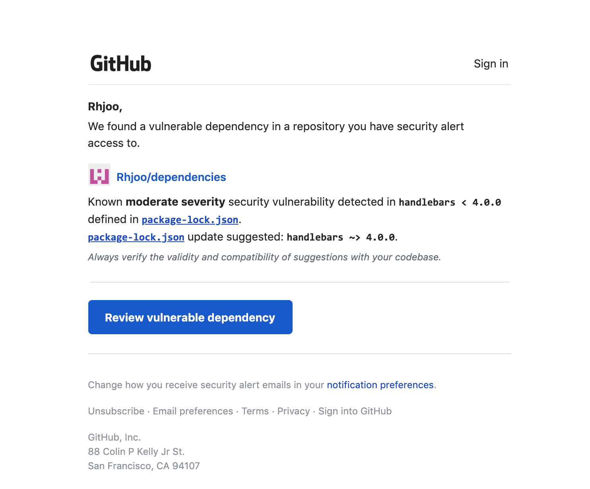

If you've ever used any npm packages in your projects, most likely you will have come across warnings from either npm or GitHub (or any other remote online repository services you use) about security vulnerabilities found in those installed packages. As your project gets older, more npm packages or dependencies will have been exposed of vulnerabilities. 

In this post, I will show you how to get rid of those npm security vulnerability warnings. They may be annoying, but they're there for a reason, to help developers be aware of security vulnerabilities in the dependencies they're using. So, you don't want to just get rid of them or ignore them. You want to update the vulnerable npm packages, which is the right way to clear these alerts.

Let's start a dummy node project called "dependencies," then I will go ahead and install an old npm package with a known vulnerability.
```bash
npm init
```
Now in the package.json file, I will add an outdated "handlebars" package.
```js
"dependencies": {
  "handlebars": "^3.0.0"
}
```
Then, let's go ahead and install this package.
```bash
npm install
```
Right away, npm will warn you of the vulnerabilities.
```bash
found 3 vulnerabilities (2 high, 1 critical)
  run `npm audit fix` to fix them, or `npm audit` for details
``` 
<br />

<blockquote style="color:#9cb3c9">Quick tips: In sematic versioning, x.y.z means major version x, minor version y, patch version z. The symbols in front mean: @4.7.6 - exact version. ~4.7.6 - any patch version of 4.7 later than 4.7.6, ^4.7.6 any minor version of 4 later than 4.7, >=4.7.6 - any version later than 4.7.6</blockquote>

If you use GitHub to store this project, they will also email you an alert.  
 
So, let's fix this security vulnerability. First step is to find out more about this vulnerability.
```bash
npm audit
```
You will get a detailed report.
```bash
                       === npm audit security report ===                        
                                                                                
# Run  npm install handlebars@4.4.3  to resolve 3 vulnerabilities
SEMVER WARNING: Recommended action is a potentially breaking change
┌───────────────┬──────────────────────────────────────────────────────────────┐
│ High          │ Cross-Site Scripting                                         │
├───────────────┼──────────────────────────────────────────────────────────────┤
│ Package       │ handlebars                                                   │
├───────────────┼──────────────────────────────────────────────────────────────┤
│ Dependency of │ handlebars                                                   │
├───────────────┼──────────────────────────────────────────────────────────────┤
│ Path          │ handlebars                                                   │
├───────────────┼──────────────────────────────────────────────────────────────┤
│ More info     │ https://npmjs.com/advisories/61                              │
└───────────────┴──────────────────────────────────────────────────────────────┘
┌───────────────┬──────────────────────────────────────────────────────────────┐
│ Critical      │ Prototype Pollution                                          │
├───────────────┼──────────────────────────────────────────────────────────────┤
│ Package       │ handlebars                                                   │
├───────────────┼──────────────────────────────────────────────────────────────┤
│ Dependency of │ handlebars                                                   │
├───────────────┼──────────────────────────────────────────────────────────────┤
│ Path          │ handlebars                                                   │
├───────────────┼──────────────────────────────────────────────────────────────┤
│ More info     │ https://npmjs.com/advisories/755                             │
└───────────────┴──────────────────────────────────────────────────────────────┘
┌───────────────┬──────────────────────────────────────────────────────────────┐
│ High          │ Prototype Pollution                                          │
├───────────────┼──────────────────────────────────────────────────────────────┤
│ Package       │ handlebars                                                   │
├───────────────┼──────────────────────────────────────────────────────────────┤
│ Dependency of │ handlebars                                                   │
├───────────────┼──────────────────────────────────────────────────────────────┤
│ Path          │ handlebars                                                   │
├───────────────┼──────────────────────────────────────────────────────────────┤
│ More info     │ https://npmjs.com/advisories/1164                            │
└───────────────┴──────────────────────────────────────────────────────────────┘

found 3 vulnerabilities (2 high, 1 critical) in 28 scanned packages
  3 vulnerabilities require semver-major dependency updates.
```
Let's find out what the current version of "handlebars" package is.
```bash
npm outdated
```
```bash
Package     Current  Wanted  Latest  Location
handlebars    3.0.7   3.0.7   4.4.3  dependencies
```
You can see that when I indicated I want "handlebars" version ^3.0.0 in my package.json, npm installed the latest minor version and patches under major version 3, which in this case is 3.0.7. The latest version of "handlebars" at the time of this writing is 4.4.3. As our email from GitHub suggested, we need any version above 4.0.0 (>4.0.0). We can do so by either
```bash
npm install handlebars --save
```
or 
```bash
npm update handlebars --save
```
Either will install the latest version of "handlebars," and update the package.json. Another way is, if you want npm to automatically fix all vulnerabilities at once, you can simply type
```bash
npm audit fix
```
When you do that, npm will actually warn you that going from one major version to another major version (as we are doing in this case) may introduce breaking changes. So it won't actually fix the problem. If you're sure the update won't cause breakage of your app, or you're confident that you will be able to modify your code to fix the breaking changes, then you can 
```bash
npm audit fix --force
```
```bash
npm WARN using --force I sure hope you know what you are doing.
npm WARN dependencies@1.0.0 No repository field.

+ handlebars@4.4.3
added 2 packages from 1 contributor, removed 17 packages and updated 3 packages in 0.655s
fixed 3 of 3 vulnerabilities in 28 scanned packages
  1 package update for 3 vulns involved breaking changes
  (installed due to `--force` option)
```
If you return to your package.json file, you will see that the dependencies have been updated.
```js
"dependencies": {
  "handlebars": "^4.4.3"
}
```
With that said, the best way to update your dependencies is to do so incrementally on a periodic basis. You want to periodically run `npm audit`. You don't really want to jump from a major version to another. Also important is having adequate test coverage for your project, which will enable you to tackle any future dependency updates with confidence.

What about when the dependency warning comes from not the package you installed yourself, but comes from a package that the package you installed uses as one of _its_ dependencies? It won't show up on your package.json. You will have to dig a little deeper, you may find them in the package-lock.json file. You can't just manipulate package-lock.json file, which is more of a direct representation of all the dependencies your app is using.

Let's assume there's a fake dependency that uses an old version of "handlebars," which carries a vulnerability. You can 
```bash
npm ls handlebars
```
Which might show a dependency tree like this.
```bash
dependencies@1.0.0
└─┬ some-fake-dependency@8.6.0
  └─┬ another-fake-dependency@7.2.0
    └─┬ yet-another-fake-dependency@1.3.7
      └─┬ last-fake-dependency@1.5.1
        └── handlebars@3.0.7 
```
In this case, you can't just update "handlebars" package and be done with it, as it may break any of the parent dependencies. At the top level, you will want to update "some-fake-dependency." But, first you will want to check that the most recent parent package has fixed the vulnerable child dependencies first. I haven't found the easiest way to do so, except starting a dummy project and installing the latest parent package and see which version of child dependency it uses. 

Once you are confident that the latest parent package has fixed the vulnerability, you can `npm install <parent package>`.
```bash
npm install some-fake-dependency --save
```
You can also
```bash
npm update some-fake-dependency --save
```

Lastly, if you want to learn more about semantic versioning convention, here's [npm documentation](https://docs.npmjs.com/about-semantic-versioning), which also has a helpful [npm semver calculator](https://semver.npmjs.com/). 