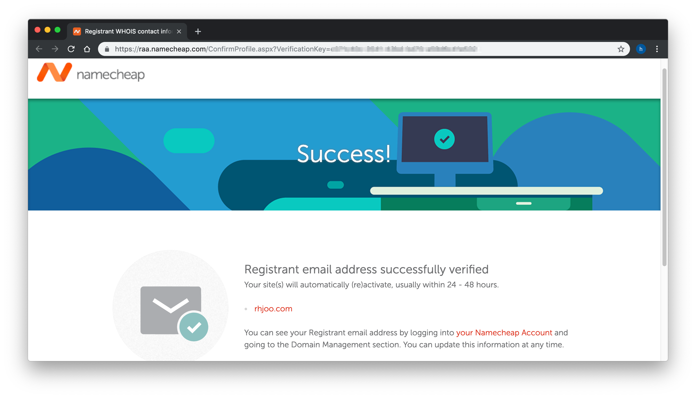
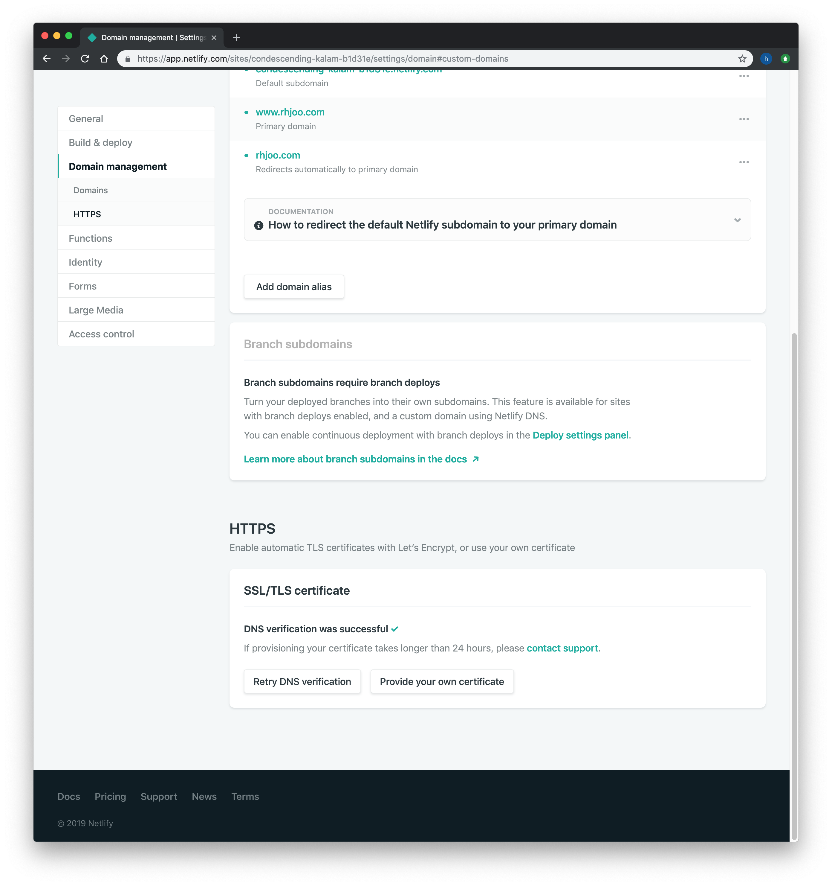

In this part, I'll be showing you the next 3 steps of deploying your site to the internet. 1) Buy a domain name of your choice. 2) Deploy to Netlify. 3) Connect your domain name to Netlify.

First step is to buy a domain name. I did this on [namecheap.com](https://www.namecheap.com). I did some research, and namecheap offers simple interface and also gives you free privacy protection of your ICANN registration data, which other domain name selling services charge extra. Also it was fairly affordable, I think it will be hard to beat $8.88/yr! 

Now you have your own domain name on the web, second step is to find a webhost to host your site. I chose [Netlify](https://www.netlify.com) as I heard a lot of good things about it, especially with building a static site like Gatsby. It also provides you with automatic renewal of SSL certificate, which you will have to do manually every 3 months otherwise. And the best part of it is it's free for small personal projects like this.

First, go to Netlify website and sign up. Easiest way to do so is by using your Github account or whichever git hosting service you use. 

From there, you can click "New site from Git" to connect your Github repo to Netlify. 

You have to grant access to Netlify from your Github account.

Then, specifiy which branch of your repo to be the target of deployment, as well as build command and build directory. If you're not sure what all these mean or if you don't need more advanced deployment options, just leave them as default, which is what I did. Then, simply click "Deploy site."

Then, Netlify will start building your site with an arbitrarily generated subdomain url.  

I did run into some hiccups at first. My first deployment attempt failed because I found out there were some naming inconsistencies in my project. For example, I named my React component Navbar, but the file name was named navbar.js (with a small n). Netlify deployment environment appears somewhat more strict than my local development environment. That's something you want to watch out for. I should have perhaps started deploying to Netlify right away from the beginning instead of entirely doing development on my local environment until I thought it was ready to deploy to the web. Since then, Netlify has actually released [Netlify Dev](https://www.netlify.com/products/dev/), which not only allows you deploy to Netlify directly from your command line, but also to a simulated local dev server. It's still on beta however, at the time of this writing.

Fortunately, after about a half hour of debugging and realizing my mistake, I was able to successfully deploy to Netlify. Phew!~ Imagine if you built a very large complex web app and it didn't actually work on your host server! 😭🤮

Next step is to add a custom domain to your Netlify site.  

It was a little bit confusing to figure out how to do this, but I followed the doc from [Netlify](https://www.netlify.com/docs/custom-domains/#assigning-a-custom-domain). I needed to head back to namecheap, and change the domain host records.

Finally I was able to get it up on my custom domain www.rhjoo.com, but without https.

I needed to wait for Netlify's DNS propagation to finish.

Even after it said on Netlify website that DNS verification was successful, it took awhile for https to show before my domain name. I went to bed that night, and when I checked in the morning, it was finally up as https.

Wow, that was a lot of steps! It took awhile, and there were some hiccups, but hopefully this helps some of you who are interested in putting your own site up. Thanks for reading this far.