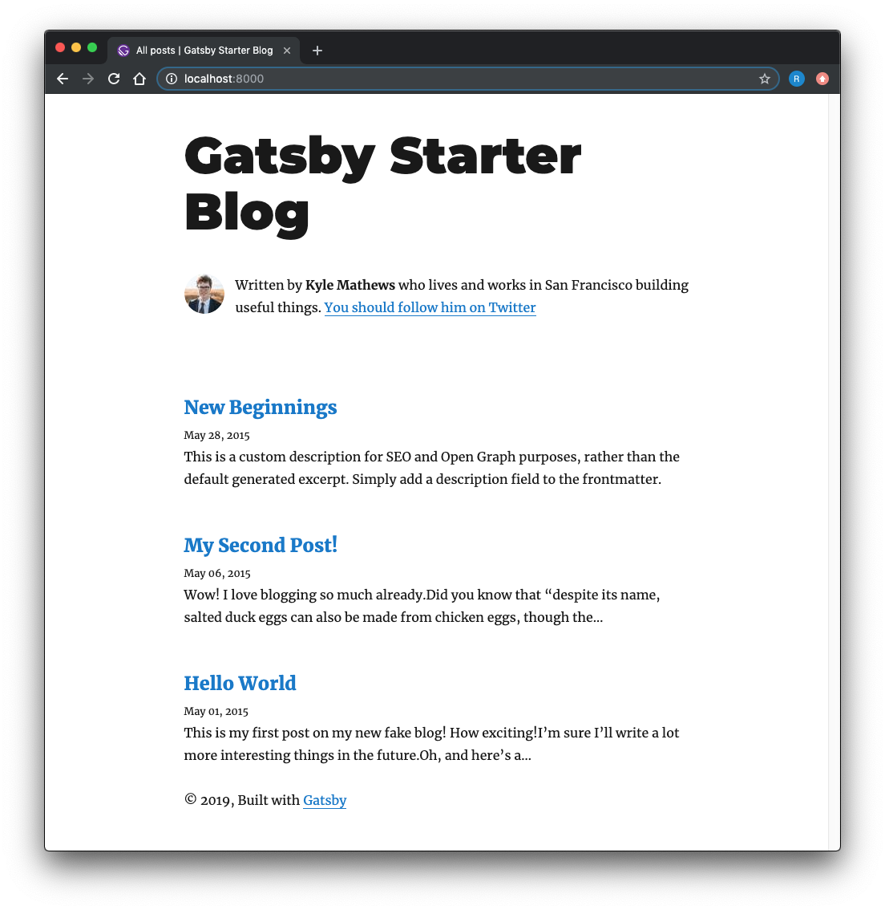

In case anyone is wondering (which is likely very few out there), but if anyone is interested in building a simple tech blog like this one, I will show you how I built this site in the next couple of posts. It is also to document the process as a reminder to my future self. Basic technology behind it is [Gatsby](https://www.gatsbyjs.org/), more specifically [Gatsby Starter Blog template](https://www.gatsbyjs.org/starters/gatsbyjs/gatsby-starter-blog/), and it's deployed on [Netlify](https://www.netlify.com/).

In Part 1, I'll be showing you how I got a Gatsby site working in my local environment, and further developed it. It took about 2 weeks (since I only had a few hours on nights and weekends) to make it look the way I wanted and until I got my first post written. I took inspiration from [Tania Rascia](https://www.taniarascia.com/)'s site. Her site has since changed somewhat since when I was drawing inspirations from. I know my site looks absolutely rudimentary compared to hers, but I'm still learning this web development thing. In Part 2, I'll be showing you how I actually deployed it to Netlify. 

Assuming you have Node installed on your machine, first step is to install Gatsby CLI (Command Line Interface), which allows you to quickly create a Gatsby site from the command line.
```
npm install -g gatsby-cli
```
Then, I created a simple Gatsby site by pulling the Gatsby Starter Blog template from their [Github repo](https://github.com/gatsbyjs/gatsby-starter-blog).
```
gatsby new rhjoo-blog https://github.com/gatsbyjs/gatsby-starter-blog
```
Then, you can go to the folder and simply start the development site on your machine, which is served at localhost:8000.
```
cd rhjoo-blog
gatsby develop
```
It will look like the following.

Gatsby allows hot reloading, which means that when you start tinkering with your code to modify the template to suit your needs and when you save the files, Gatsby will automatically reload the website. This makes the development process a breeze since you don't have to stop and restart the server each time you want to see how your new code changes the site.

This info may be too basic, but to stop the server, type control-C.

Besides the [Gatsby documents](https://www.gatsbyjs.org/docs/) itself, I watched this video series on [YouTube](https://www.youtube.com/watch?v=oAVhEPey_qA). It was a little bit different from what I wanted to do with Gatsby, but I was able to get a basic idea of how to go about tinkering with the files. Each blog post gets a new folder inside content/blog folder. Each post is an index.md markdown file inside the folder. Gatsby takes care of the routing and slugs for you. I used [styled-components](https://www.styled-components.com/) to style the site. [PrismJS](https://prismjs.com/) was used as the syntax highlighter, and Gatsby has a [plugin](https://www.gatsbyjs.org/packages/gatsby-remark-prismjs/) for this. Lastly, feel free to go to my [github repo](https://github.com/Rhjoo/rhjoo-blog) for this site to actually check out the code.

On the next post, I will show you how to escape your local development environment and deploy your site to Netlify.