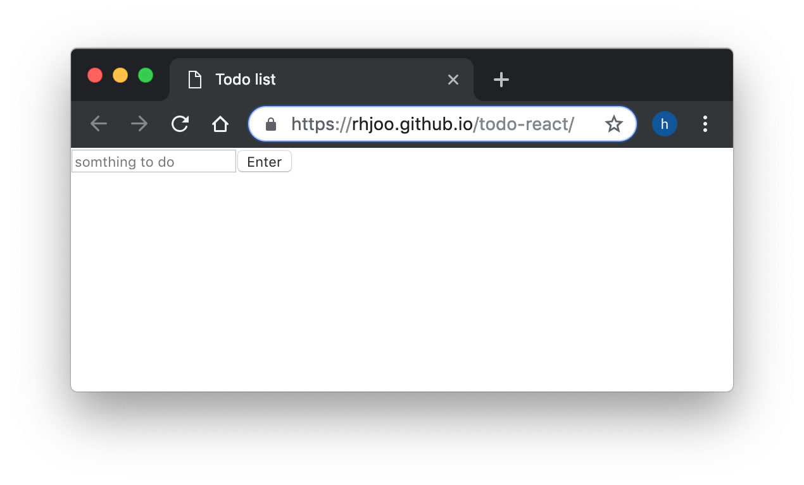
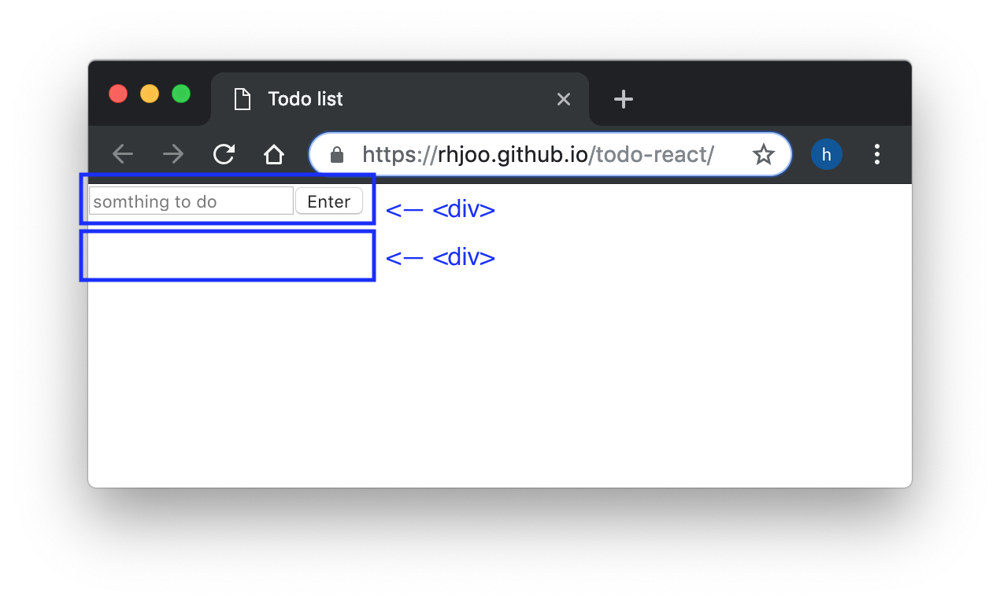

Without further ado, let's start building a simple todo app using React. Here's what the final product of the bare bones todo app looks like. https://rhjoo.github.io/todo-react/

You will see that right now there is a section where you will input your tasks, but there is also a section where the tasks will be displayed (invisible as of now since there are no tasks that have been created).

To accomplish this layout, on a traditional html page, you would write something like this.
```html
<body>
  <div id="todo-form">
    <input type="text" placeholder="something to do">
    <button>Enter</button>
  </div>
  <div id="todo-list">
    <ul></ul>
  </div>
</body>
```
But, that's not what we want to do here since we want to write this app using React, which will take care of creating and rendering html elements for us. Instead, we can write our custom components (React.Components) like the following, which conceptually replaces the `<div>`s.
```js
class App extends React.Component {
  render() {
    return (
      <TodoForm />
      <TodoList />
    );
  }
}
```
On a side note: (1) Don't worry too much about the syntax right now as we will get to that as we start to actually create our app. (2) Technically the above code won't work because React will complain that adjacent elements must be wrapped in an enclosing tag inside a render method. I just wanted to demonstrate how React allows you to create an html element with the name of your choice that makes sense to you.

React accomplishes this by way of implementing something called JSX, which basically allows you to use html like syntax inside javascript. Inside `<TodoForm />` and `<TodoList />` components, you will write render methods that will actually display the `input`, `button`, and `ul`.

So, that's the basic idea of React. It allows you to build user interfaces in a way that is more intuitive for most people, in my opinion. Another advantage is that you can re-use these components. This is especially handy when your application grows, you won't have to write the same code multiple times.

Next step, let's go ahead and start building our application using `create-react-app`.