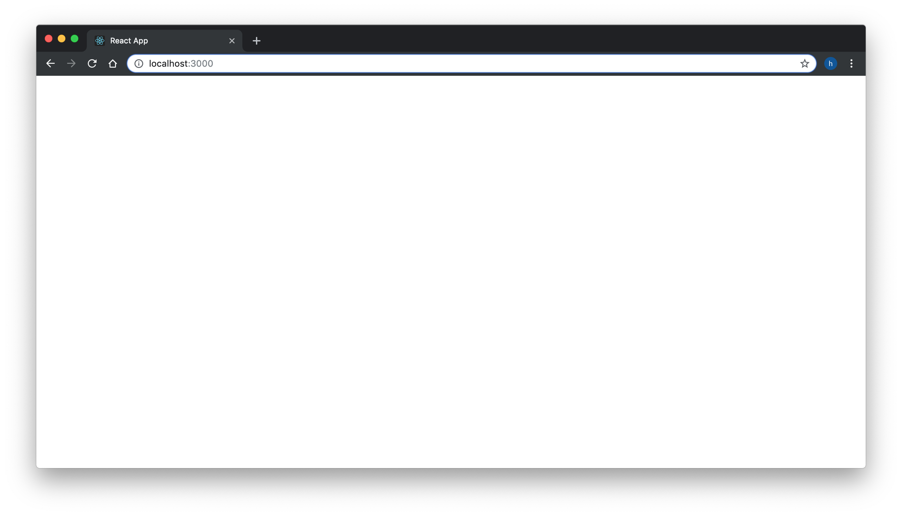

One of the easiest ways to get started with React is the 'create-react-app.' It is an npm ([Node Package Manager](https://www.npmjs.com/package/create-react-app)) package created by Dan Abramov and others, members of React Core team at Facebook. It allows you to deploy your app on a localhost on your computer, and see the app develop via hot reloading, which basically means that as you change your code it gets immediately reflected on your app upon save, which makes developing apps a much more enjoyable experience. 

First, you need to install the create-react-app package on your machine. Oops, I'm getting ahead of myself, of course you will have to install npm first. When you download [Node.js](https://nodejs.org/), which allows JavaScript to be run on your terminal, npm comes along with it. Once you have done that, go to your terminal and type `npm install -g create-react-app`. You may have to type `sudo` (which stands for superuser do) in the beginning of the command if you run into an administrative privilege error. It will prompt you to enter your password to allow installation of create-react-app globally. If you don't feel comfortable using sudo, you may want to omit the `-g` argument. 

Then, let's go ahead and create your first React app by typing `create-react-app to-do-list` on your terminal. Go ahead and move to the folder you just created by typing `cd to-do-list`, and run your app by typing `npm start`. Voila, you have your first React app up and running!

Let's inspect what's going on in our boilerplate code. Go to src folder and open up index.js and App.js.
```js
//index.js
import React from 'react';
import ReactDOM from 'react-dom';
import './index.css';
import App from './App';
import * as serviceWorker from './serviceWorker';

ReactDOM.render(<App />, document.getElementById('root'));

// If you want your app to work offline and load faster, you can change
// unregister() to register() below. Note this comes with some pitfalls.
// Learn more about service workers: https://bit.ly/CRA-PWA
serviceWorker.unregister();
```
You have to import React first in each of your files if you're building a React.Component or using JSX syntax. index.js uses ReactDom to render our `<App />` on our html document (index.html is located in the public folder, feel free to inspect that file as well). `<App />` is located in App.js, which gets exported at the end of the file, which in turn is imported by index.js. 
```js
//App.js
import React, { Component } from 'react';
import logo from './logo.svg';
import './App.css';

class App extends Component {
  render() {
    return (
      <div className="App">
        <header className="App-header">
          
          <p>
            Edit <code>src/App.js</code> and save to reload.
          </p>
          <a
            className="App-link"
            href="https://reactjs.org"
            target="_blank"
            rel="noopener noreferrer"
          >
            Learn React
          </a>
        </header>
      </div>
    );
  }
}

export default App;
```
Our App is created as a React.Component. You do so by using the class syntax, and it's a strong convention to capitalize the first letter of the component you just created. Inside it, it uses React.Component's render method to create html elements. The familiar html element brackets are actually JSX. You will notice what's inside ```<div className="App"></div>``` matches what you see on our current page above, displaying the React logo and imploring you to edit the App.js file to create your own app, which is exactly what we are going to do next.

Since we want to create our own app, let's do some spring cleaning. Erase everything except what's left down below in the index.js and App.js. For the time being, do not worry about styling or service worker, which has to do with building a progressive web app.

```js
//index.js
import React from 'react';
import ReactDOM from 'react-dom';
import App from './App';

ReactDOM.render(<App />, document.getElementById('root'));
```
```js
//App.js
import React, { Component } from 'react';

class App extends Component {
  render() {
    return (
      <div className="App">
        
      </div>
    );
  }
}

export default App;
```
Once you save the changed files, you will see a blank app.


Let's type something to make sure our app is still working. 
```js
//App.js
import React, { Component } from 'react';

class App extends Component {
  render() {
    return (
      <div className="App">
        <h1>Hello World!</h1>
      </div>
    );
  }
}

export default App;
```


It's time to finally build our first UI. Let's put an input element and an enter button on our page.
```js
//App.js
import React, { Component } from 'react';

class App extends Component {
  render() {
    return (
      <div className="App">
        <input type="text" placeholder="something to do" />
        <button type="submit">Enter</button>
      </div>
    );
  }
}

export default App;
```

As I have mentioned in an earlier post, React components are re-usable. One way to accomplish that is by separating each components in its own file. Let's create a new file called TodoForm.js and move the UI elements we just created into that file. Make sure to export and import TodoForm so both files are connected.
```js
//TodoForm.js
import React from 'react';

class TodoForm extends React.Component {
  render() {
    return (
      <div className="todoList">
        <form>
          <input type="text" placeholder="something to do" />
          <button type="submit">Enter</button>
        </form>
      </div>
    );
    
  }
}

export default TodoForm;
```
```js
//App.js
import React, { Component } from 'react';
import TodoForm from './TodoForm';

class App extends Component {
  render() {
    return (
      <div className="App">
        <TodoForm />
      </div>
    );
  }
}

export default App;
```


That's it for now! Our app should still look the same. Our form UI has been created, however if you type anything into the input box you will notice nothing happens. In our next tutorial, we will learn how to store our input.