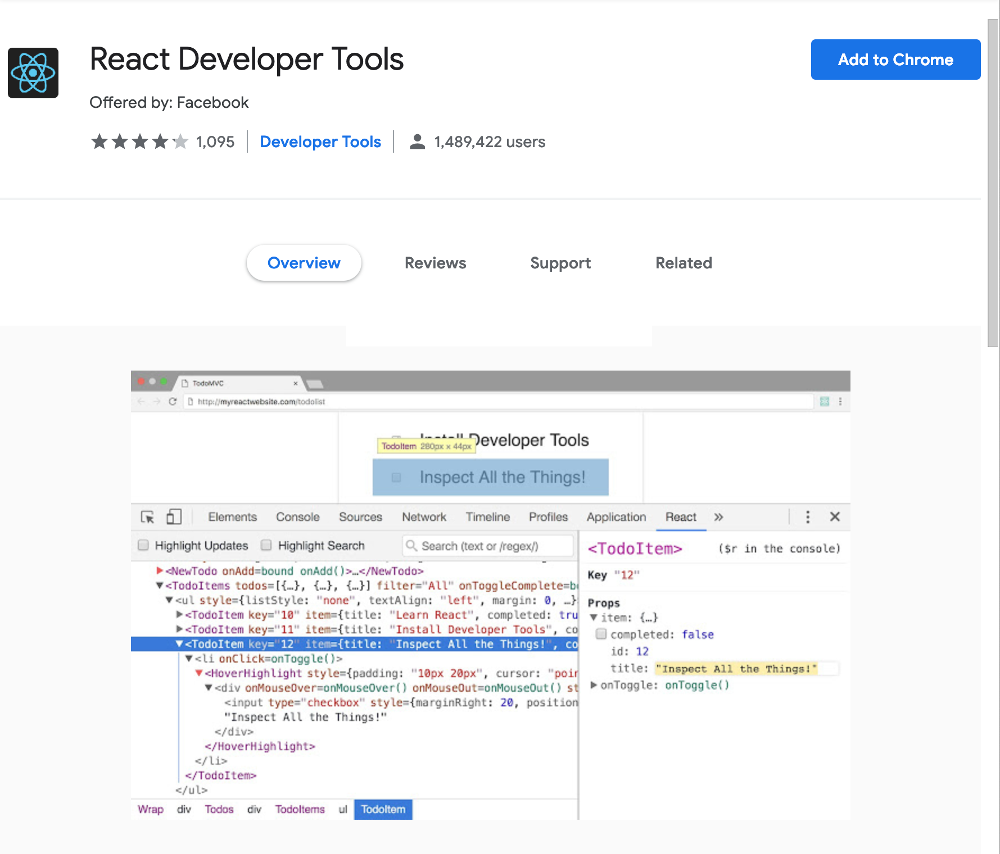
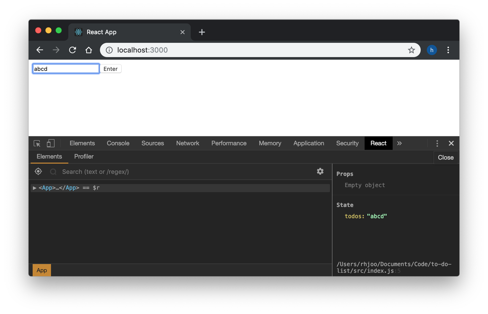
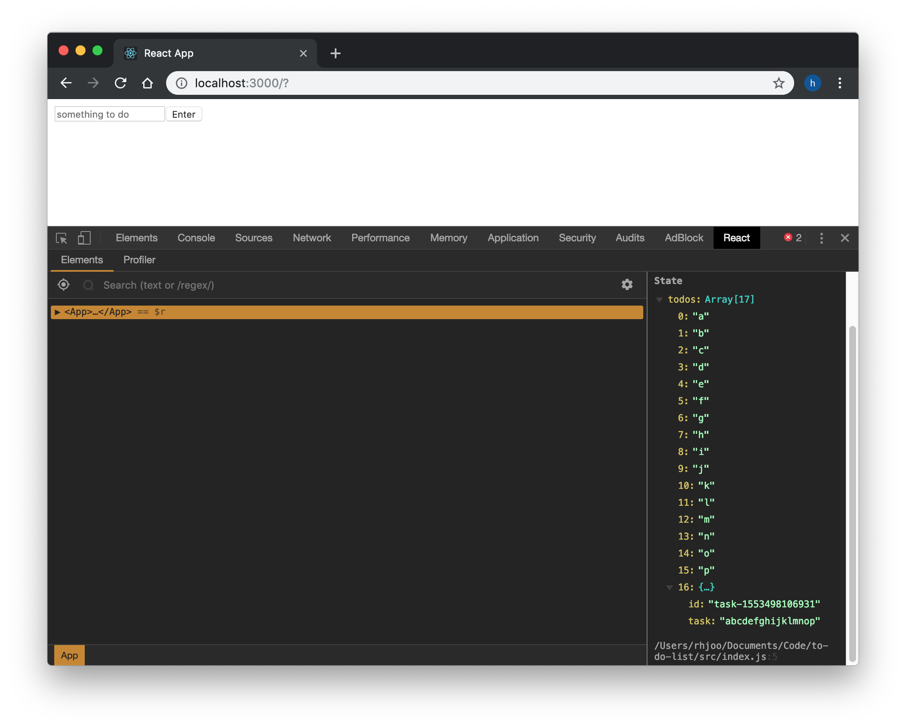
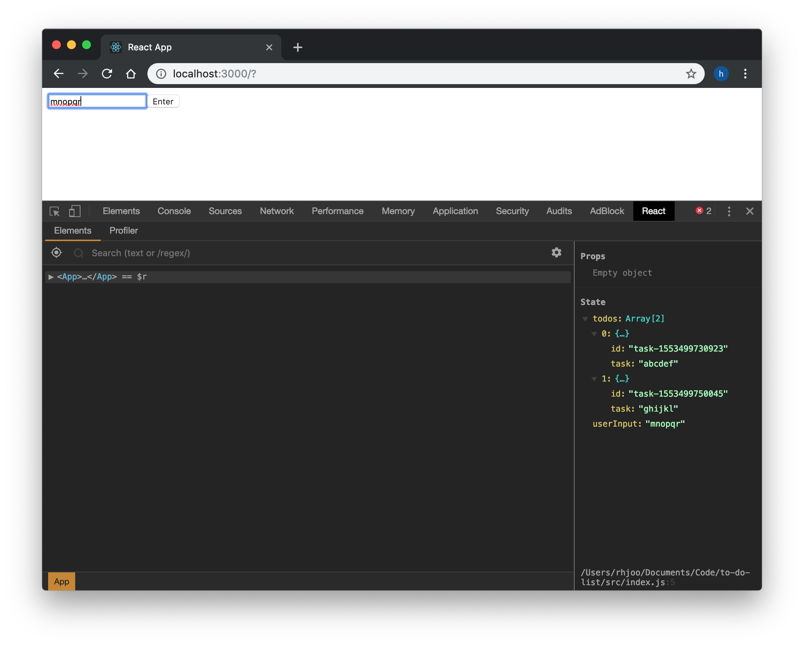

Now we are getting into the meaty part of the project. In this section, we will be learning how to store user input into our data. In React, data is typically stored in "state." State is created and stored in a parent component, this way you have a central location where all your data is stored and whenever there is a change in your data, all your components can look to the parent component and get the necessary data to reflect any change. One thing to note here is that state can only be created in class based React.Component. State-less components (or more properly called function components) cannot have their own states. We will discuss more about this later.

First, in our App component you have to call the class `constructor()` method, which initializes the object created by the class key word. Within it, you have to call `super()`, which is a keyword used to access and call functions on an object's parent. I'm going to create my todos data as an array of objects (todos: [ ]) instead of an object of objects (todos: { }) as I have seen some other tutorials do. Arrays are easier to manipulate, in my opinion.  You will see what I mean when we get to rendering our data on the webpage using Array.map().
```js
//App.js
class App extends Component {
  constructor() {
    super()
    this.state = {
      todos: []
    }
  }  
  render() {
    return (
      <div className="App">
        <TodoForm />
      </div>
    );
  }
}
export default App;
```
Next, in the input element in our TodoForm component, let's create `onChange` attribute, which will call `handleChange()` function, which will be passed down from the parent component App as a prop. Think of prop or property as a piece of data or function that can be passed from one React component to another. You do so by directly adding it into the child component `<TodoForm />` inside the angle brackets. Then, go ahead and create the `handleChange()` method inside the App component. The `handleChange()` method receives `event` as argument from `onChange` attribute. And for the time being, to make sure everything is hooked up, let's `console.log` something.
```js
//TodoForm.js
class TodoForm extends React.Component {
  render() {
    return (
      <div className="todoList">
        <form> 
          <input type="text" placeholder="something to do" onChange={this.props.handleChange}/>
          <button type="submit">Enter</button>
        </form>
      </div>
    );
  }
}
export default TodoForm;
```
```js
//App.js
class App extends Component {
  constructor() {
    super()
    this.state = {
      todos: []
    }
  }  
  handleChange(event) {
    console.log("user input being registered!")
  }
  render() {
    return (
      <div className="App">
        <TodoForm handleChange={this.handleChange}/>
      </div>
    );
  }
}
export default App;
```
Let's actually do something with the `event`, which actually gives us the value of the user input in `event.target.value`, let's create a variable to receive the value using ES6 destructuring syntax, and save it into todos by calling setState. Whenever you use setState method in your class component, you have to bind the method using the setState method in the constructor. At this point, I highly recommend installing React Developer Tools Chrome extension, with which you can inspect what's being created and stored in the state real time.
```js
constructor(props) {
  super(props)
  this.state = {
    todos: []
  }
  this.handleChange = this.handleChange.bind(this)
}

handleChange(event) {
  const { value } = event.target
  this.setState({ todos: value })
}
```


However, you will notice that, once you press Enter, the page refreshes and the state resets, and all your data is gone. To prevent this, let's override the default behavior of `<form>` element, which is to send HTTP request upon submit. While we're at it we will also clear the user input area when Enter button is clicked. We will do this by creating `handleSubmit()` method. Don't forget to pass it as a prop to `<TodoForm />` as we have done with `handleChange()`.
```js
//TodoForm.js
class TodoForm extends React.Component {
  render() {
    return (
      <div className="todoList">
        <form onSubmit={this.props.handleSubmit}> 
          <input type="text" placeholder="something to do" onChange={this.props.handleChange}/>
          <button type="submit">Enter</button>
        </form>
      </div>
    );
  }
}
export default TodoForm; 
```
```js
//App.js
handleSubmit(event) {
  event.preventDefault()
  event.target.reset()
}
//
<TodoForm handleChange={this.handleChange} handleSubmit={this.handleSubmit} />
//
```
Now, you will notice that at this time we're only storing the data as _one_ string, and once you type over it, your previous task is lost. What we want to do is add each task as an object to the todos array. First, in our `handleSubmit()` method we create an empty object `newTodo = {}` to store our new input. We will create a property called `id`, which will be auto-generated using Date.now() method that comes with JavaScript. We do this now because when we get to rendering each data as an element by array .map method, React will ask that each element has a unique key, which we will provide from our `id`. We then add both `id` and `task` to the newTodo, which in turn will be pushed into the copy of our state. React discourages you to directly push data into the state. By making a copy of the state, modifying it, then updating the state by setState method you preserve the ability to traverse timeline of state as it changes over the time. Notice `[...]` array spread method to make a copy of the existing array.
```js
//App.js
class App extends Component {
  constructor(props) {
    super(props)
    this.state = {
      todos: []
    }
    this.handleChange = this.handleChange.bind(this)
    this.handleSubmit = this.handleSubmit.bind(this)
  }
  
  handleChange(event) {
    const { value } = event.target
    this.setState({ todos: value })
  }
  
  handleSubmit(event) {
    event.preventDefault()
    const copyOfTodosState = [...this.state.todos]
    const newTodo = {}
    const timestamp = Date.now()
    newTodo.id =`task-${timestamp}`
    newTodo.task = this.state.todos
    copyOfTodosState.push(newTodo)
    this.setState({ todos: copyOfTodosState })
    event.target.reset()
  }

  render() {
    return (
      <div className="App">
        <TodoForm handleChange={this.handleChange} handleSubmit={this.handleSubmit}/>
      </div>
    );
  }
}

export default App;
```
At this point, your App should look as above. However, there's a problem. Once `handleSubmit()` is called, the data is submitted to do our state fine, but each letter stroke is also entered into our state separately. 

We only want data to be added to our state only when `handleSubmit()` is called. The best way to go about this, I think, is to create another variable in our state to keep track of what the user has typed in the input field, then once Enter button is entered, pull that data and push it into the todos in state. Now the code will look like the following and we're almost done.
```js
//App.js
class App extends Component {
  constructor(props) {
    super(props)
    this.state = {
      userInput: "",
      todos: []
    }
    this.handleChange = this.handleChange.bind(this)
    this.handleSubmit = this.handleSubmit.bind(this)
  }
  
  handleChange(event) {
    const { value } = event.target
    this.setState({ userInput: value })
  }
  
  handleSubmit(event) {
    event.preventDefault()
    this.setState({ userInput: "" })
    const copyOfTodosState = [...this.state.todos]
    const newTodo = {}
    const timestamp = Date.now()
    newTodo.id =`task-${timestamp}`
    newTodo.task = this.state.userInput
    copyOfTodosState.push(newTodo)
    this.setState({ todos: copyOfTodosState })
    event.target.reset()
  }

  render() {
    return (
      <div className="App">
        <TodoForm handleChange={this.handleChange} handleSubmit={this.handleSubmit} />
      </div>
    );
  }
}

export default App;
```

Before we move on, let's do some refactoring.  The `handleSubmit()` method is quite long. Here I went ahead and created a separate `createTodo()` method, which `handleSubmit()` method calls inside. This makes it a little more concise and easy to follow what the method is actually doing. 

Another step I took is when dealing with forms, React prefers that React state be the "single source of truth" instead of HTML elements like `<input>` which can maintain its own data. An input form element whose value is controlled by React is called a [controlled component](https://reactjs.org/docs/forms.html#controlled-components), which is the preferred technique. In compliance with this idea, we can pass down the `userInput` as a prop, which then can be what's displayed in the input box in `<TodoForm />`. On the surface, you won't notice any difference in how the app works. Lastly, since `<TodoForm />` does not have its own method or state, we can change it into a function component. Be sure to remove `this` wherever `props` is used. Lastly, in the `handleSubmit()` method, you have to manually reset userInput back to "" by using the setState method.
```js
//App.js
import React, { Component } from 'react';
import TodoForm from './TodoForm';

class App extends Component {
  constructor(props) {
    super(props)
    this.state = {
      userInput: "",
      todos: []
    }
    this.handleChange = this.handleChange.bind(this)
    this.handleSubmit = this.handleSubmit.bind(this)
    this.createTodo = this.createTodo.bind(this)
  }
  
  handleChange(event) {
    const { value } = event.target
    this.setState({ userInput: value })
  }
  
  handleSubmit(event) {
    event.preventDefault()
    this.createTodo()
    this.setState({ userInput: "" })
    event.target.reset()
  }

  createTodo() {
    const copyOfTodosState = [...this.state.todos]
    const newTodo = {}
    const timestamp = Date.now()
    newTodo.id =`task-${timestamp}`
    newTodo.task = this.state.userInput
    copyOfTodosState.push(newTodo)
    this.setState({ todos: copyOfTodosState })
  }

  render() {
    return (
      <div className="App">
        <TodoForm handleChange={this.handleChange} handleSubmit={this.handleSubmit} userInput={this.state.userInput}/>
      </div>
    );
  }
}

export default App;
```
```js
//TodoForm.js
import React from 'react';

function TodoForm (props) {
  return (
    <div className="todoList">
      <form onSubmit={props.handleSubmit}> 
        <input type="text" value={props.userInput} placeholder="something to do" name="todos" onChange={props.handleChange}/>
        <button type="submit">Enter</button>
      </form>
    </div>
  );
}

export default TodoForm;
```
Now we have a working app that stores user's input into our state! Next and final step is to figure out a way to display our data on the page. 