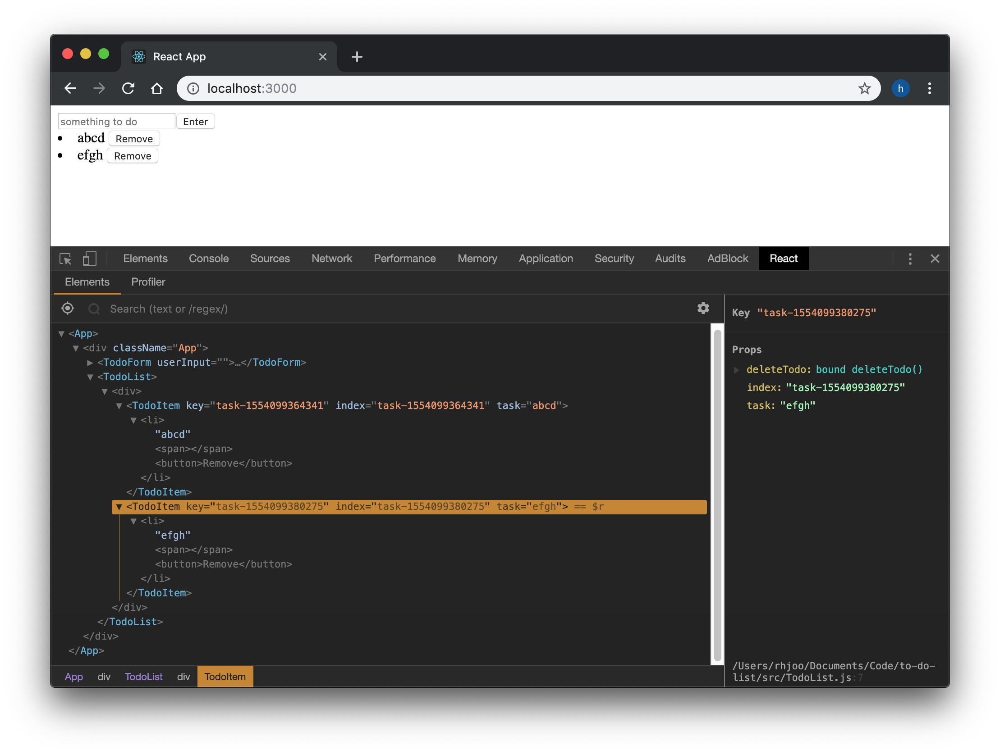
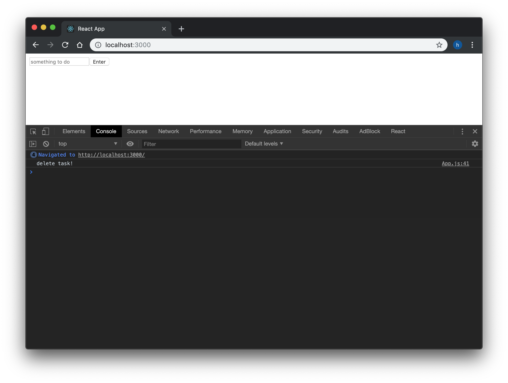

We are on the home stretch here, let's go ahead and display our data on the page. We will create a new Component named TodoList. By using Array.map() method we will create an unordered list. Of course, TodoList should be imported and used in the render method of our App.
```js
//Todolist.js
import React from 'react'

function TodoList(props) {
  return (
    <div>
      {props.todos.map(item => <TodoItem key={item.id} task={item.task} />)}
    </div>
  )
}

export default TodoList
```
```js
//App.js
import TodoList from './TodoList';
//
//
render() {
  return (
    <div className="App">
      <TodoForm handleChange={this.handleChange} handleSubmit={this.handleSubmit} userInput={this.state.userInput}/>
      <TodoList todos={this.state.todos} />
    </div>
  );
}
```
We're passing down our state.todos as a prop to TodoList.  It in return is used to render TodoItem list, which is actually an li, using Array.map(). Here we're using the id to create each li with unique key, which is what React wants us to do. We will create a Remove button at the same time as well.
```js
import React from 'react'

function TodoItem(props) {
  return (
    <li>
      {props.task}
      <span> </span>
      <button>Remove</button>
    </li>
  )
}

export default TodoItem
```

Now we just need to get the Remove button working. We will create a deleteTodo function in our App, then hook up the props down the child elements like the following. We will just have deleteTodo console.log something to make sure everything is hooked up correctly.
```js
//App.js
deleteTodo() {
  console.log("delete task!")
} 
//
//
render() {
  return (
    <div className="App">
      <TodoForm handleChange={this.handleChange} handleSubmit={this.handleSubmit} userInput={this.state.userInput}/>
      <TodoList todos={this.state.todos} deleteTodo={this.deleteTodo}/>
    </div>
  );
}
```
```js
import React from 'react'
import TodoItem from './TodoItem'

function TodoList(props) {
  return (
    <div>
      {props.todos.map(item => <TodoItem key={item.id} task={item.task} deleteTodo={props.deleteTodo}/>)}
    </div>
  )
}

export default TodoList
```
```js
import React from 'react'

function TodoItem(props) {
  return (
    <li>
      {props.task}
      <span> </span>
      <button onClick={() => props.deleteTodo()}>Remove</button>
    </li>
  )
}

export default TodoItem
```

Here comes the most challenging part of actually writing the code for the deleteTodo method. Let's break it down step by step. It will first make a copy of state.todos. It will receive the index of the list item we want to delete from TodoItem, then it fill find the array matching the id using Array.findIndex(). After that we can splice that object out from our state.todos array. Lastly we will use setState method to update our state. Don't forget to bind the method in the constructor as usual. You will notice that I passed item.id twice (once as the key and once as a prop called index), this is because key is not a prop, hence cannot be used in the child component. You can pass the props.index into our deleteTodo method as argument in TodoItem, which then uses it to find the object with the matching id.
```js
//App.js
constructor() {
  //
  //
  this.deleteTodo = this.deleteTodo.bind(this)
}
//
//
deleteTodo(index) {
  const copyOfTodosState = [...this.state.todos]
  const indexToDelete = copyOfTodosState.findIndex(item => item.id === index)
  copyOfTodosState.splice(indexToDelete, 1)
  this.setState({ todos: copyOfTodosState });
}
```
```js
//TodoList.js
import React from 'react'
import TodoItem from './TodoItem'

function TodoList(props) {
  return (
    <div>
      {props.todos.map(item => <TodoItem key={item.id} index={item.id} task={item.task} deleteTodo={props.deleteTodo}/>)}
    </div>
  )
}

export default TodoList
```
```js
///TodoItem.js
import React from 'react'

function TodoItem(props) {
  return (
    <li>
      {props.task}
      <span> </span>
      <button onClick={() => props.deleteTodo(props.index)}>Remove</button>
    </li>
  )
}

export default TodoItem
```
So, we went through this rather quickly, but we learned mapping to create child components.  We also created a method that gets passed down couple of components deep as props, which is then attached to an event listener attribute onClick. I hope you enjoyed the lessons, as I learned as well while creating these articles. Overall, a good initial place to start is Bob Ziroll's interactive lessons found on [Scrimba](https://scrimba.com/g/glearnreact). And as always, check out the official [React Documentation](https://reactjs.org/docs/getting-started.html).