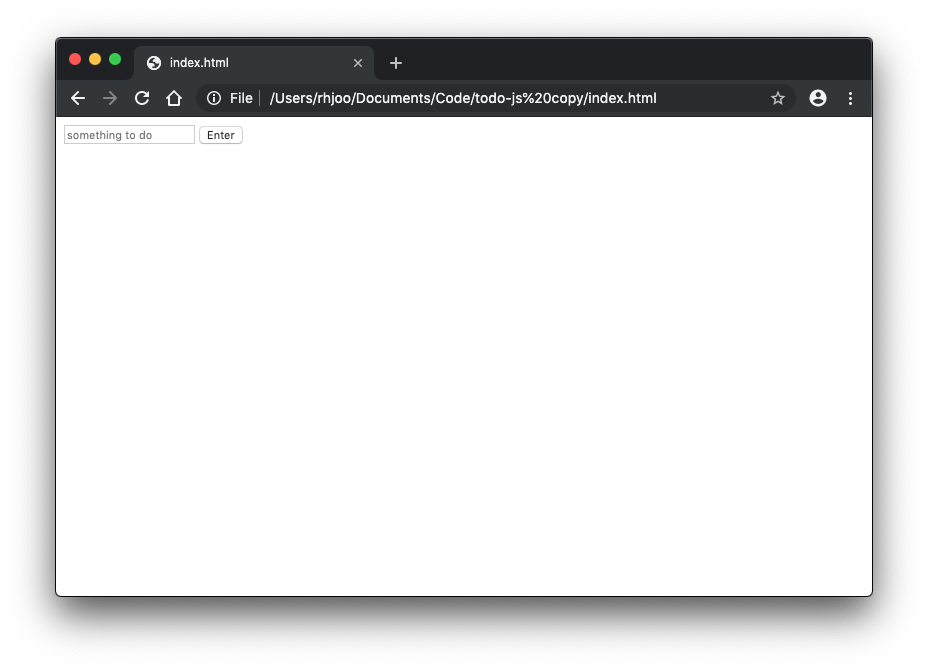
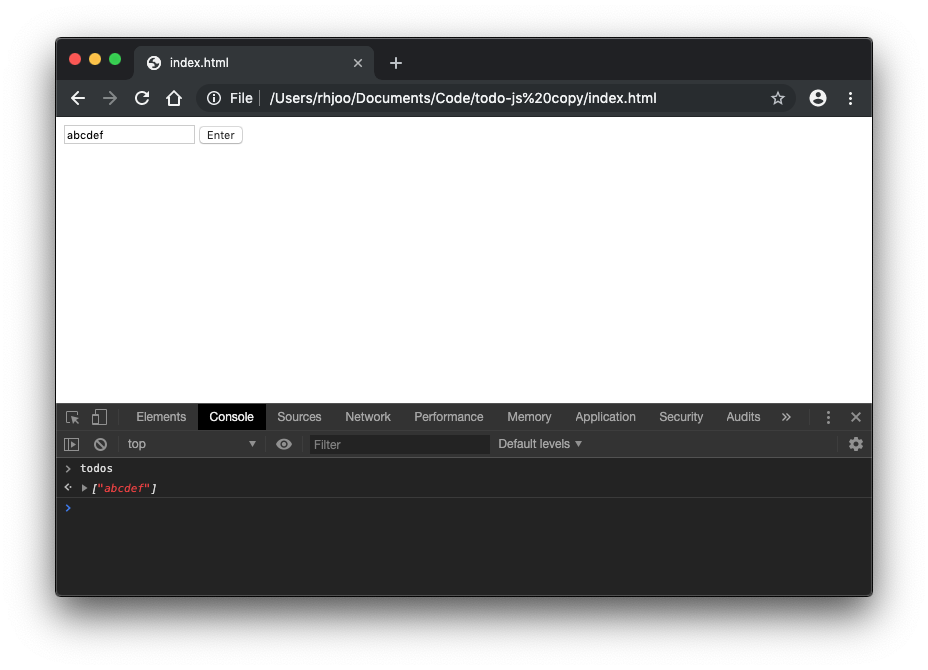
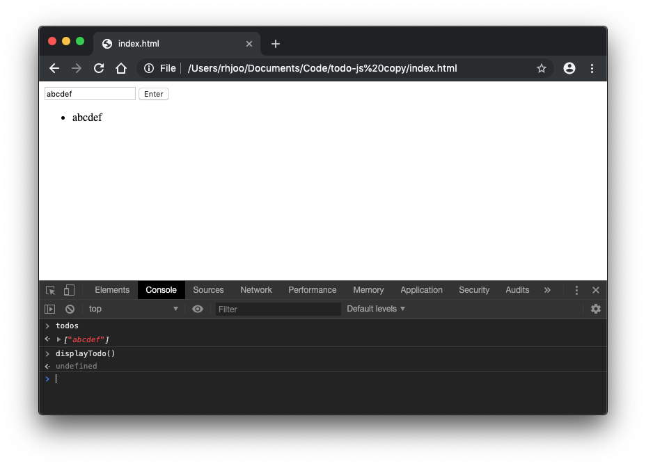
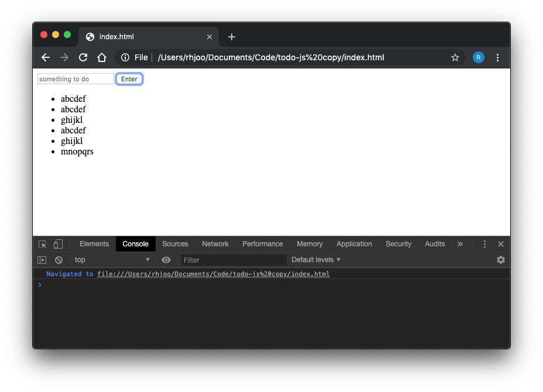
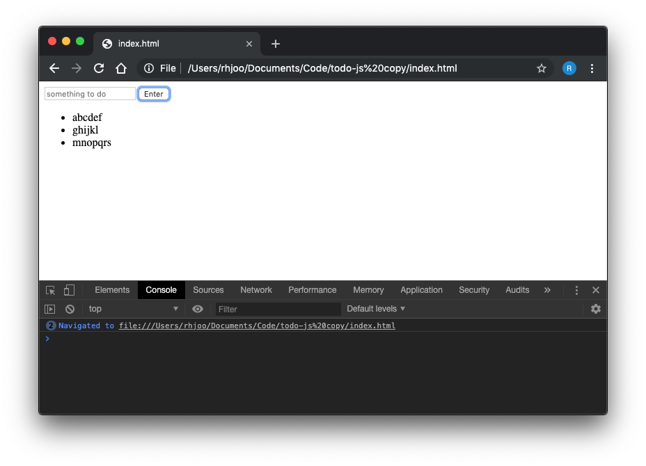

Let's go ahead and start building a simple todo app using vanilla JavaScript. Here's what the final product of the bare bones todo app looks like. https://rhjoo.github.io/todo-js/. It should look the same as the todo app  we created using React https://rhjoo.github.io/todo-react/.


As before, we will create a div for tor the user input, and an empty unordered list where the todo items will be displayed. 
```html
<body>
  <div>
    <input id="todoInput" type="text" placeholder="something to do">
    <button>Enter</button>
  </div>
  <ul>

  </ul>
</body>
```

Then, we will create a new JavaScript file where all our logic will go. Here we will hold the data as an array called todos. 
```js
//myscript.js
const todos = [];
```
Next, let's write a function called addTodo that takes user input and pushes into the todos array.
```js
//myscript.js
const todos = [];

function addTodo() {
  let todoInput = document.getElementById('todoInput');
  todos.push(todoInput.value);
}
```
Next, let's write a function called displayTodo to display the data as a ul.
```js
function displayTodo() {
  let todosUl = document.querySelector('ul');
  todos.forEach(function(todo) {
    let todoLi = document.createElement('li');
    todoLi.textContent = todo;
    todosUl.appendChild(todoLi);
  });
}
```

I think this is a good place to stop and take a look at our app that we created so far. Make sure that you put the script tag to load our myscript.js in the body of the html file. 
```html
//index.html
<!DOCTYPE html>
<html>
<head>
  
</head>
<body>
  <div>
    <input id="todoInput" type="text" placeholder="something to do">
    <button>Enter</button>
  </div>
  <ul>

  </ul>
  <script type="text/javascript" src="myscript.js"></script>
</body>
</html>
```
```js
//myscript.js
const todos = [];

function addTodo() {
  let todoInput = document.getElementById('todoInput');
  todos.push(todoInput.value);
}

function displayTodo() {
  let todosUl = document.querySelector('ul');
  todos.forEach(function(todo) {
    let todoLi = document.createElement('li');
    todoLi.textContent = todo;
    todosUl.appendChild(todoLi);
  });
}
```
You can open the app by dragging the index.html file to the address bar of your browser.

But, you will notice that our input doesn't clear when you press Enter, furthermore nothing is being displayed. Let's open up the browser console and see what's happening. You can open your browser console by alt+command+J. Type todos and you will see that our app has pushed the input into the todos array, which means that addTodo() has done its job.

You may wonder how come it's not displaying our data. That's because we have not called the displayTodo() function. Let's go ahead and call it in the console, then you will see our item show up in the app.

Knowing this, we will call displayTodo() inside our addTodo() function. At the same time, we will reset the input field to blank.
```js
//myscript.js
const todos = [];

function addTodo() {
  let todoInput = document.getElementById('todoInput');
  todos.push(todoInput.value);
  displayTodo();
  todoInput.value = "";
}
```

Now you will notice there's a problem here. Every time displayTodo() is called, it displays the same data below the data previously displayed. In order to solve this, we will reset the innerHTML each time displayTodo() is called.
```js
//myscript.js
function displayTodo() {
  let todosUl = document.querySelector('ul');
  todosUl.innerHTML = "";
  todos.forEach(function(todo) {
    let todoLi = document.createElement('li');
    todoLi.textContent = todo;
    todosUl.appendChild(todoLi);
  });
}
```

Phew, that was a lot to cover. Let's take a break here, and pick up next time when we will work on implementing the remove button.