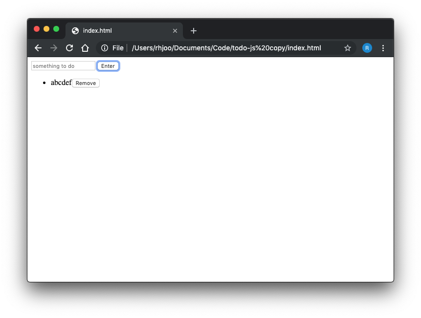
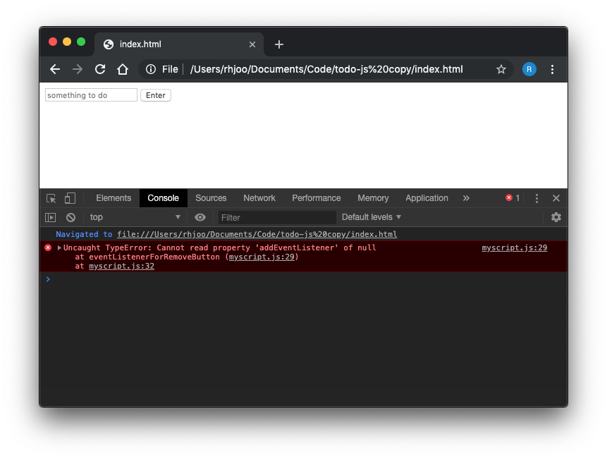

In this tutorial, we will write code to create remove buttons, which will be displayed to the right of the tasks generated by the user. Later in the tutorial, we will make the remove button functional, meaning when the user clicks on it, it will remove the task. Let's get to it.

First, we are going to write a function called createRemoveButton(), which will return a button element. Each button will have textContent of "Remove." We will call this function inside of displayTodo() function, where we will append the button to the li that was just created. 

```js
//myscript.js
function displayTodo() {
  let todosUl = document.querySelector('ul');
  todosUl.innerHTML = "";
  todos.forEach(function(todo) {
    let todoLi = document.createElement('li');
    todoLi.textContent = todo;
    todoLi.appendChild(this.createRemoveButton());
    todosUl.appendChild(todoLi);
  });
}

function createRemoveButton() {
  let removeButton = document.createElement('button');
  removeButton.textContent = 'Remove';
  return removeButton;
}
```

Great, now comes the more difficult part of making the Remove button to actually remove the task. My initial attempt was the following, but it did not work. I'll explain why. Here, I added a click eventListener for each li, but the button still doesn't work. The browser console tells us there is an error, which states "Uncaught TypeError: Cannot read property 'addEventListener' of null."
```js
//myscript.js
(function eventListenerForRemoveButton() {
  let todosLi = document.querySelector('li');
  todosLi.addEventListener('click', function(event) {
    todos.splice(event.target, 1);
    displayTodo();
  });
})();
```

This is because when the app starts, there is no li's for the eventListener to attach to. We will have to add an eventListener to the parent element ul, and somehow avoid the whole ul becoming one giant eventListener. My next attempt sort of works, but there are couple of problems still. One is that the event is triggered when user clicks anywhere on the ul not just the button. Two is that it removes the ul's first li no matter which task you click. 
```js
//myscript.js
(function eventListenerForRemoveTodo() {
  let todosUl = document.querySelector('ul');
  todosUl.addEventListener('click', function(event) {
    todos.splice(event.target, 1);
    displayTodo();
  });
})();
```
The following solves the fist problem. Here, I give the button a className, which is then used in the if statement which checks if the element clicked is a button, i.e. has a class name of 'removeButton.' Only when the if statement is true, it goes ahead and splices an item. 
```js
//myscript.js
function createRemoveButton() {
  let removeButton = document.createElement('button');
  removeButton.textContent = 'Remove';
  removeButton.className = 'removeButton';
  return removeButton;
}

(function eventListenerForRemoveTodo() {
  let todosUl = document.querySelector('ul');
  todosUl.addEventListener('click', function(event) {
    let elementClicked = event.target;
    if (elementClicked.className === 'removeButton') {
      todos.splice(elementClicked, 1);
      displayTodo();
    }
  });
})();
```
The solution to the second problem is to give each li an id when it is created in the displayTodo() function. We can utilize the position attribute provided by an array, assign it as id for each li. Which, we will then specify when we splice it out. 
```js
//myscript.js
function displayTodo() {
  let todosUl = document.querySelector('ul');
  todosUl.innerHTML = "";
  todos.forEach(function(todo, position) {
    let todoLi = document.createElement('li');
    todoLi.id = position;
    todoLi.textContent = todo;
    todoLi.appendChild(this.createRemoveButton());
    todosUl.appendChild(todoLi);
  });
}

(function eventListenerForRemoveTodo() {
  let todosUl = document.querySelector('ul');
  todosUl.addEventListener('click', function(event) {
    let elementClicked = event.target;
    if (elementClicked.className === 'removeButton') {
      todos.splice(elementClicked.parentNode.id, 1);
      displayTodo();
    }
  });
})();
```
That's all there is to it! To recap today's tutorial, we wrote couple of functions, one to add Remove buttons, another to remove tasks, which is triggered by a click event, which has to be "listened to" by adding an eventListener. 

You can be the judge and decide whether vanilla JS or React was easier to create this simple Todo app. Even though it took us fewer number of tutorials, in the overall scheme of things, I think React was more intuitive. React does require a little bit more set up and comes with a learning curve. Vanilla JS is easier to get up and running, but you are writing more imperative code (as opposed to declarative), meaning you have to implement the details of how each function should behave, in this case how data is added and removed, and how data is displayed into the DOM. Lastly, I'd like to give credit to Gordon Zhu's Practical JavaScript course on [Watch and Code](https://watchandcode.com/) for these last two tutorials. Final myscript.js file should look as the following.
```js
//myscript.js
const todos = [];

function addTodo() {
  let todoInput = document.getElementById('todoInput');
  todos.push(todoInput.value);
  displayTodo();
  todoInput.value = "";
}

function displayTodo() {
  let todosUl = document.querySelector('ul');
  todosUl.innerHTML = "";
  todos.forEach(function(todo, position) {
    let todoLi = document.createElement('li');
    todoLi.id = position;
    todoLi.textContent = todo;
    todoLi.appendChild(this.createRemoveButton());
    todosUl.appendChild(todoLi);
  });
}

function createRemoveButton() {
  let removeButton = document.createElement('button');
  removeButton.textContent = 'Remove';
  removeButton.className = 'removeButton';
  return removeButton;
}

(function eventListenerForRemoveTodo() {
  let todosUl = document.querySelector('ul');
  todosUl.addEventListener('click', function(event) {
    let elementClicked = event.target;
    if (elementClicked.className === 'removeButton') {
      todos.splice(elementClicked.parentNode.id, 1);
      displayTodo();
    }
  });
})();
```